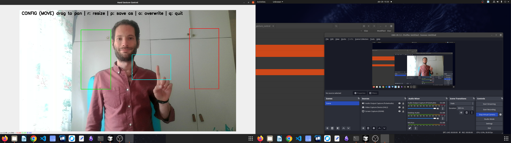
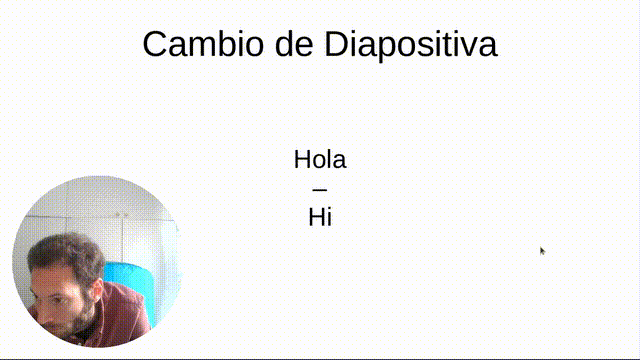

# Slide the Slide Sliding the Index by RegoData

A responsive hand‑gesture slide controller with an interactive layout editor. Use your camera (prefered OBS Virtual Camera) and simple hand gestures to navigate through presentation slides without touching your keyboard.

## Features

- **Hand Tracking Module**  
  - Uses MediaPipe & OpenCV to detect and track hand landmarks.  
  - Returns 2D landmark positions with configurable drawing.  
  - Encapsulated in `HandTrackingModule.py` for easy reuse.

- **Gesture‑Driven Slide Control**  
  - Point your index finger into a central “ready” zone, then move into left/right zones to navigate slides.  
  - Automatic timeout if gesture isn’t completed within **5 seconds**.

- **Interactive Layout Editor**  
  - Press **`c`** to enter config‑move mode (drag zones around).  
  - Press **`r`** (inside config) to toggle resize mode (drag borders to resize).  
  - Save custom layouts with **`p`** (save-as) or overwrite with **`o`**.  
  - Layouts stored as JSON (`last_config.json` and named exports).

- **OBS Virtual Camera Support**  
  - Automatically detects and connects to OBS Virtual Camera on Linux/Mac or Windows.  
  - Falls back gracefully with helpful instructions if camera stream isn’t available.

## Demo

  


## Requirements

- Python 3.11  
- [OpenCV](https://pypi.org/project/opencv-python/)  
- [MediaPipe](https://pypi.org/project/mediapipe/)  
- [PyAutoGUI](https://pypi.org/project/PyAutoGUI/)  
- NumPy

```bash
pip install -r requirements.txt
